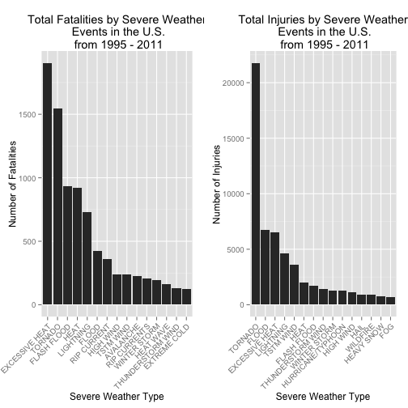
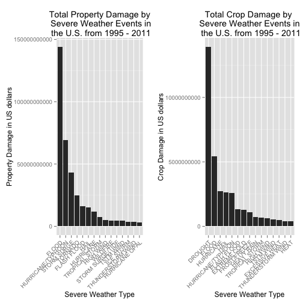

Reproducible Research-Assignment2
==========================================
### Basic settings

```r
echo = TRUE  # Always make code visible
options(scipen = 1)  # Turn off scientific notations for numbers
library(R.utils)
library(ggplot2)
library(plyr)
require(gridExtra)
```

### Data Processing
```r
setwd("~/MyProject/datasciencecoursera/ReproducesibleResearch-Assignment2/RepData_PeerAssessment2/")

if (!"stormData.csv.bz2" %in% dir("./data/")) {
    print("hhhh")
    download.file("http://d396qusza40orc.cloudfront.net/repdata%2Fdata%2FStormData.csv.bz2", destfile = "data/stormData.csv.bz2")
    bunzip2("data/stormData.csv.bz2", overwrite=T, remove=F)
}
```

```r
if (!"stormData" %in% ls()) {
    stormData <- read.csv("data/stormData.csv", sep = ",")
}
dim(stormData)
```

```
## [1] 902297     38
```

```r
head(stormData, n = 2)
```

```
##   STATE__          BGN_DATE BGN_TIME TIME_ZONE COUNTY COUNTYNAME STATE
## 1       1 4/18/1950 0:00:00     0130       CST     97     MOBILE    AL
## 2       1 4/18/1950 0:00:00     0145       CST      3    BALDWIN    AL
##    EVTYPE BGN_RANGE BGN_AZI BGN_LOCATI END_DATE END_TIME COUNTY_END
## 1 TORNADO         0                                               0
## 2 TORNADO         0                                               0
##   COUNTYENDN END_RANGE END_AZI END_LOCATI LENGTH WIDTH F MAG FATALITIES
## 1         NA         0                        14   100 3   0          0
## 2         NA         0                         2   150 2   0          0
##   INJURIES PROPDMG PROPDMGEXP CROPDMG CROPDMGEXP WFO STATEOFFIC ZONENAMES
## 1       15    25.0          K       0                                    
## 2        0     2.5          K       0                                    
##   LATITUDE LONGITUDE LATITUDE_E LONGITUDE_ REMARKS REFNUM year
## 1     3040      8812       3051       8806              1 1950
## 2     3042      8755          0          0              2 1950
```
```r
if (dim(stormData)[2] == 37) {
    stormData$year <- as.numeric(format(as.Date(stormData$BGN_DATE, format = "%m/%d/%Y %H:%M:%S"), "%Y"))
}
hist(stormData$year, breaks = 30)
```

 

```r
storm <- stormData[stormData$year >= 1995, ]
dim(storm)
```

```
## [1] 681500     38
```
#### Impact on Public Health
```r
sortHelper <- function(fieldName, top = 15, dataset = stormData) {
    index <- which(colnames(dataset) == fieldName)
    field <- aggregate(dataset[, index], by = list(dataset$EVTYPE), FUN = "sum")
    names(field) <- c("EVTYPE", fieldName)
    field <- arrange(field, field[, 2], decreasing = T)
    field <- head(field, n = top)
    field <- within(field, EVTYPE <- factor(x = EVTYPE, levels = field$EVTYPE))
    return(field)
}

fatalities <- sortHelper("FATALITIES", dataset = storm)
injuries <- sortHelper("INJURIES", dataset = storm)
```

#### Impact on Economy

```r
convertHelper <- function(dataset = storm, fieldName, newFieldName) {
    totalLen <- dim(dataset)[2]
    index <- which(colnames(dataset) == fieldName)
    dataset[, index] <- as.character(dataset[, index])
    logic <- !is.na(toupper(dataset[, index]))
    dataset[logic & toupper(dataset[, index]) == "B", index] <- "9"
    dataset[logic & toupper(dataset[, index]) == "M", index] <- "6"
    dataset[logic & toupper(dataset[, index]) == "K", index] <- "3"
    dataset[logic & toupper(dataset[, index]) == "H", index] <- "2"
    dataset[logic & toupper(dataset[, index]) == "", index] <- "0"
    dataset[, index] <- as.numeric(dataset[, index])
    dataset[is.na(dataset[, index]), index] <- 0
    dataset <- cbind(dataset, dataset[, index - 1] * 10^dataset[, index])
    names(dataset)[totalLen + 1] <- newFieldName
    return(dataset)
}

storm <- convertHelper(storm, "PROPDMGEXP", "propertyDamage")
```

```r
storm <- convertHelper(storm, "CROPDMGEXP", "cropDamage")
```

```r
names(storm)
```

```
##  [1] "STATE__"        "BGN_DATE"       "BGN_TIME"       "TIME_ZONE"     
##  [5] "COUNTY"         "COUNTYNAME"     "STATE"          "EVTYPE"        
##  [9] "BGN_RANGE"      "BGN_AZI"        "BGN_LOCATI"     "END_DATE"      
## [13] "END_TIME"       "COUNTY_END"     "COUNTYENDN"     "END_RANGE"     
## [17] "END_AZI"        "END_LOCATI"     "LENGTH"         "WIDTH"         
## [21] "F"              "MAG"            "FATALITIES"     "INJURIES"      
## [25] "PROPDMG"        "PROPDMGEXP"     "CROPDMG"        "CROPDMGEXP"    
## [29] "WFO"            "STATEOFFIC"     "ZONENAMES"      "LATITUDE"      
## [33] "LONGITUDE"      "LATITUDE_E"     "LONGITUDE_"     "REMARKS"       
## [37] "REFNUM"         "year"           "propertyDamage" "cropDamage"
```

```r
options(scipen=999)
property <- sortHelper("propertyDamage", dataset = storm)
crop <- sortHelper("cropDamage", dataset = storm)
```

### Results

```r
fatalities
```

```
##               EVTYPE FATALITIES
## 1     EXCESSIVE HEAT       1903
## 2            TORNADO       1545
## 3        FLASH FLOOD        934
## 4               HEAT        924
## 5          LIGHTNING        729
## 6              FLOOD        423
## 7        RIP CURRENT        360
## 8          HIGH WIND        241
## 9          TSTM WIND        241
## 10         AVALANCHE        223
## 11      RIP CURRENTS        204
## 12      WINTER STORM        195
## 13         HEAT WAVE        161
## 14 THUNDERSTORM WIND        131
## 15      EXTREME COLD        126
```

```r
injuries
```

```
##               EVTYPE INJURIES
## 1            TORNADO    21765
## 2              FLOOD     6769
## 3     EXCESSIVE HEAT     6525
## 4          LIGHTNING     4631
## 5          TSTM WIND     3630
## 6               HEAT     2030
## 7        FLASH FLOOD     1734
## 8  THUNDERSTORM WIND     1426
## 9       WINTER STORM     1298
## 10 HURRICANE/TYPHOON     1275
## 11         HIGH WIND     1093
## 12              HAIL      916
## 13          WILDFIRE      911
## 14        HEAVY SNOW      751
## 15               FOG      718
```
```r
fatalitiesPlot <- qplot(EVTYPE, data = fatalities, weight = FATALITIES, geom = "bar", binwidth = 1) + 
    scale_y_continuous("Number of Fatalities") + 
    theme(axis.text.x = element_text(angle = 45, 
    hjust = 1)) + xlab("Severe Weather Type") + 
    ggtitle("Total Fatalities by Severe Weather\n Events in the U.S.\n from 1995 - 2011")
injuriesPlot <- qplot(EVTYPE, data = injuries, weight = INJURIES, geom = "bar", binwidth = 1) + 
    scale_y_continuous("Number of Injuries") + 
    theme(axis.text.x = element_text(angle = 45, 
    hjust = 1)) + xlab("Severe Weather Type") + 
    ggtitle("Total Injuries by Severe Weather\n Events in the U.S.\n from 1995 - 2011")
grid.arrange(fatalitiesPlot, injuriesPlot, ncol = 2)
```

 


```r
property
```

```
##               EVTYPE propertyDamage
## 1              FLOOD   144022037057
## 2  HURRICANE/TYPHOON    69305840000
## 3        STORM SURGE    43193536000
## 4            TORNADO    24935939545
## 5        FLASH FLOOD    16047794571
## 6               HAIL    15048722103
## 7          HURRICANE    11812819010
## 8     TROPICAL STORM     7653335550
## 9          HIGH WIND     5259785375
## 10          WILDFIRE     4759064000
## 11  STORM SURGE/TIDE     4641188000
## 12         TSTM WIND     4482361440
## 13         ICE STORM     3643555810
## 14 THUNDERSTORM WIND     3399282992
## 15    HURRICANE OPAL     3172846000
```

```r
crop
```

```
##               EVTYPE  cropDamage
## 1            DROUGHT 13922066000
## 2              FLOOD  5422810400
## 3          HURRICANE  2741410000
## 4               HAIL  2614127070
## 5  HURRICANE/TYPHOON  2607872800
## 6        FLASH FLOOD  1343915000
## 7       EXTREME COLD  1292473000
## 8       FROST/FREEZE  1094086000
## 9         HEAVY RAIN   728399800
## 10    TROPICAL STORM   677836000
## 11         HIGH WIND   633561300
## 12         TSTM WIND   553947350
## 13    EXCESSIVE HEAT   492402000
## 14 THUNDERSTORM WIND   414354000
## 15              HEAT   401411500
```

```r
propertyPlot <- qplot(EVTYPE, data = property, weight = propertyDamage, geom = "bar", binwidth = 1) + 
    theme(axis.text.x = element_text(angle = 45, hjust = 1)) + scale_y_continuous("Property Damage in US dollars")+ 
    xlab("Severe Weather Type") + ggtitle("Total Property Damage by\n Severe Weather Events in\n the U.S. from 1995 - 2011")

cropPlot<- qplot(EVTYPE, data = crop, weight = cropDamage, geom = "bar", binwidth = 1) + 
    theme(axis.text.x = element_text(angle = 45, hjust = 1)) + scale_y_continuous("Crop Damage in US dollars") + 
    xlab("Severe Weather Type") + ggtitle("Total Crop Damage by \nSevere Weather Events in\n the U.S. from 1995 - 2011")
grid.arrange(propertyPlot, cropPlot, ncol = 2)
```

 

### Conclusion  
From these data, we found that **excessive heat** and **tornado** are most harmful with respect to population health, while **flood**, **drought**, and **hurricane/typhoon** have the greatest economic consequences.
