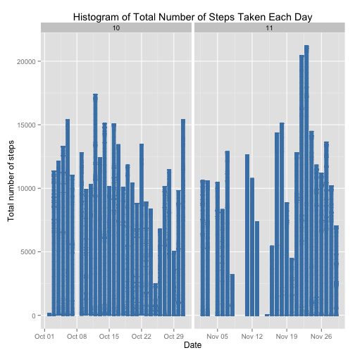
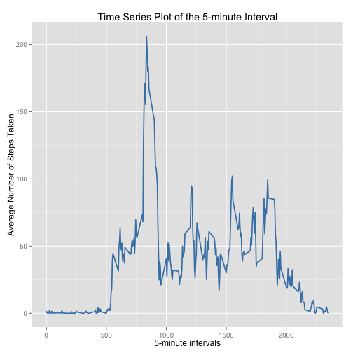
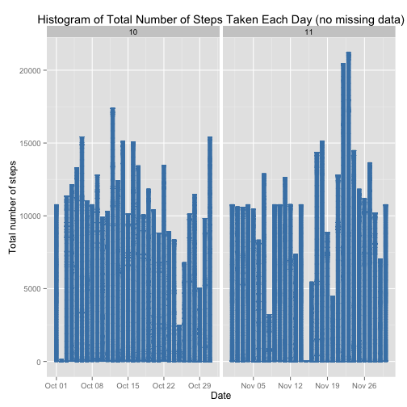

# Reproducible Research: Assignment 1
==========================================

```
library(ggplot2)
library(scales)
library(Hmisc)
```

### Required Settings
```r
echo = TRUE  
options(scipen = 1) 
```

### Load & Process Data
```r
unzip("activity.zip")
dataTable <- read.csv("activity.csv", colClasses = c("integer", "Date", "factor"))
dataTable$month <- as.numeric(format(dataTable$date, "%m"))
noNA <- na.omit(dataTable)
rownames(noNA) <- 1:nrow(noNA)
head(noNA)
```

```
##   steps       date interval month
## 1     0 2012-10-02        0    10
## 2     0 2012-10-02        5    10
## 3     0 2012-10-02       10    10
## 4     0 2012-10-02       15    10
## 5     0 2012-10-02       20    10
## 6     0 2012-10-02       25    10
```

```r
dim(noNA)
```

```
## [1] 15264     4
```

```r
library(ggplot2)
```


### What is mean total number of steps taken per day?

* Histogram of the total number of steps taken each day

```r
ggplot(noNA, aes(date, steps)) + 
geom_bar(stat = "identity", colour = "steelblue", fill = "steelblue", width = 0.7) + 
facet_grid(. ~ month, scales = "free") + 
labs(title = "Histogram of Total Number of Steps Taken Each Day", x = "Date", y = "Total Number of Steps")
```

 

* Calculate and report the mean and median total number of steps taken per day

Mean total number of steps taken per day:

```r
totalSteps <- aggregate(noNA$steps, list(Date = noNA$date), FUN = "sum")$x
mean(totalSteps)
```

```
## [1] 10766
```
Median total number of steps taken per day:

```r
median(totalSteps)
```

```
## [1] 10765
```

### What is the average daily activity pattern?
```r
avgSteps <- aggregate(noNA$steps, list(interval = as.numeric(as.character(noNA$interval))), FUN = "mean")
names(avgSteps)[2] <- "meanOfSteps"

ggplot(avgSteps, aes(interval, meanOfSteps)) + 
geom_line(color = "steelblue", size = 0.8) + 
labs(title = "Time Series Plot of the 5-minute Interval", x = "5-minute intervals", y = "Average Number of Steps Taken")
```

 

* Which 5-minute interval, on average across all the days in the dataset, contains the maximum number of steps?

```r
avgSteps[avgSteps$meanOfSteps == max(avgSteps$meanOfSteps), ]
```

```
##     interval meanOfSteps
## 104      835       206.2
```

### Imputing missing values

```r
sum(is.na(data))
```

```
## [1] 2304
```


```r
newDataTable <- dataTable
for (i in 1:nrow(newDataTable)) {
    if (is.na(newDataTable$steps[i])) {
        newDataTable$steps[i] <- avgSteps[which(newDataTable$interval[i] == avgSteps$interval), ]$meanOfSteps
    }
}

head(newDataTable)
```

```
##     steps       date interval month
## 1 1.71698 2012-10-01        0    10
## 2 0.33962 2012-10-01        5    10
## 3 0.13208 2012-10-01       10    10
## 4 0.15094 2012-10-01       15    10
## 5 0.07547 2012-10-01       20    10
## 6 2.09434 2012-10-01       25    10
```

```r
sum(is.na(newDataTable))
```

```
## [1] 0
```

```r
ggplot(newDataTable, aes(date, steps)) + 
geom_bar(stat = "identity",colour = "steelblue", fill = "steelblue",width = 0.7) + 
facet_grid(. ~ month, scales = "free") + 
labs(title = "Histogram of Total Number of Steps Taken Each Day (without missing data)", x = "Date", y = "Total Number of Steps")
```

 


```r
newTotalSteps <- aggregate(newDataTable$steps, 
                           list(Date = newDataTable$date), 
                           FUN = "sum")$x
newMean <- mean(newTotalSteps)
newMean
```

```
## [1] 10766
```
Median total number of steps taken per day:

```r
newMedian <- median(newTotalSteps)
newMedian
```

```
## [1] 10766
```
Compare them with the two before imputing missing data:

```r
oldMean <- mean(totalSteps)
oldMedian <- median(totalSteps)
newMean - oldMean
```

```
## [1] 0
```

```r
newMedian - oldMedian
```

```
## [1] 1.189
```

### Are there differences in activity patterns between weekdays and weekends?


```r
head(newDataTable)
```

```
##     steps       date interval month
## 1 1.71698 2012-10-01        0    10
## 2 0.33962 2012-10-01        5    10
## 3 0.13208 2012-10-01       10    10
## 4 0.15094 2012-10-01       15    10
## 5 0.07547 2012-10-01       20    10
## 6 2.09434 2012-10-01       25    10
```

```r
newDataTable$weekdays <- factor(format(newDataTable$date, "%A"))
levels(newDataTable$weekdays)
```

```
## [1] "Friday"    "Monday"    "Saturday"  "Sunday"    "Thursday"  "Tuesday"  
## [7] "Wednesday"
```

```r
levels(newDataTable$weekdays) <- list(weekday = c("Monday", "Tuesday",
                                             "Wednesday", 
                                             "Thursday", "Friday"),
                                 weekend = c("Saturday", "Sunday"))
levels(newDataTable$weekdays)
```

```
## [1] "weekday" "weekend"
```

```r
table(newDataTable$weekdays)
```

```
## 
## weekday weekend 
##   12960    4608
```

```r
avgSteps <- aggregate(newDataTable$steps, 
                      list(interval = as.numeric(as.character(newDataTable$interval)), 
                           weekdays = newDataTable$weekdays),
                      FUN = "mean")
names(avgSteps)[3] <- "meanOfSteps"
library(lattice)
xyplot(avgSteps$meanOfSteps ~ avgSteps$interval | avgSteps$weekdays, 
       layout = c(1, 2), type = "l", 
       xlab = "Interval", ylab = "Number of steps")
```

 
